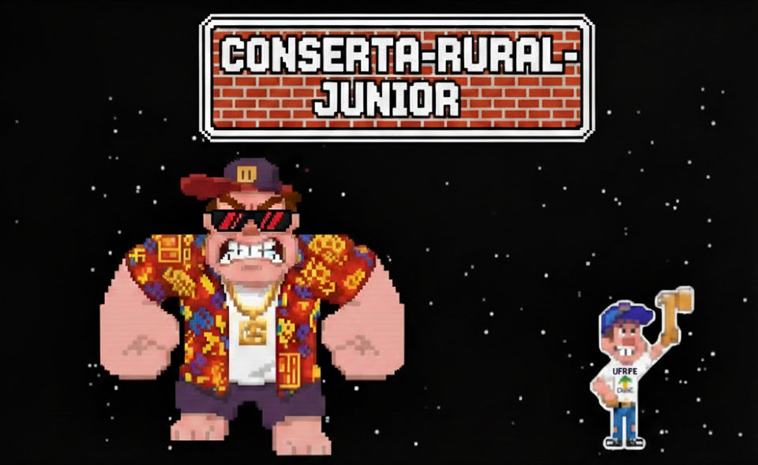

# Conserta-Rural-Junior

Projeto de jogo criado como segunda VA da disciplina de Princípios de Programação.

## Sobre o Jogo

Inspirado no clássico jogo "Conserta Félix Jr." (do filme *Detona Ralph*), **Conserta-Rural-Junior** coloca você no papel de um herói com um martelo mágico!

Um antagonista misterioso causou estragos nos prédios institucionais da UFRPE, e agora cabe a você reparar todos os danos. Utilize seu martelo para consertar janelas quebradas, paredes rachadas e restaurar a ordem no campus!

## Objetivo

* Movimente-se pelos edifícios da UFRPE.
* Use seu martelo mágico para consertar todas as áreas danificadas.
* Evite os obstáculos e os perigos deixados pelo antagonista.
* Restaure os prédios ao seu estado original para vencer!

## Controles

*(Adicione aqui os controles do seu jogo. Exemplo:)*
* **Setas (Cima, Baixo, Esquerda, Direita):** Movimentam o personagem.
* **Barra de Espaço:** Pular.
* **Tecla 'C' (ou 'Z'):** Usar o Martelo Mágico.

## Requisitos 

Para jogar o jogo basta clonar esse projeto em sua máquina e abrir ele no visual studio code. Após isso, instale a biblioteca pygame através do comando: pip install pygame e rode o programa no arquivo main

## Licença

Este projeto é distribuído sob a Licença MIT.

Copyright (c) 2025 Heitor Quental

A permissão é concedida, gratuitamente, a qualquer pessoa que obtenha uma cópia deste software e arquivos de documentação associados (o "Software"), para lidar com o Software sem restrições, incluindo, sem limitação, os direitos de usar, copiar, modificar, mesclar, publicar, distribuir, sublicenciar e/ou vender cópias do Software, e para permitir que as pessoas para quem o Software é fornecido o façam, sujeito às seguintes condições:

O aviso de copyright acima e este aviso de permissão devem ser incluídos em todas as cópias ou partes substanciais do Software.

O SOFTWARE É FORNECIDO "COMO ESTÁ", SEM GARANTIA DE QUALQUER TIPO, EXPRESSA OU IMPLÍCITA, INCLUINDO, MAS NÃO SE LIMITANDO ÀS GARANTIAS DE COMERCIALIZAÇÃO, ADEQUAÇÃO A UM FIM ESPECÍFICO E NÃO VIOLAÇÃO. EM NENHUM CASO OS AUTORES OU DETENTORES DOS DIREITOS AUTORAIS SERÃO RESPONSÁVEIS POR QUALQUER REIVINDICAÇÃO, DANOS OU OUTRA RESPONSABILIDADE, SEJA EM AÇÃO DE CONTRATO, DELITO OU DE OUTRA FORMA, DECORRENTES DE, OU EM CONEXÃO COM O SOFTWARE OU O USO OU OUTRAS NEGOCIAÇÕES NO SOFTWARE.
